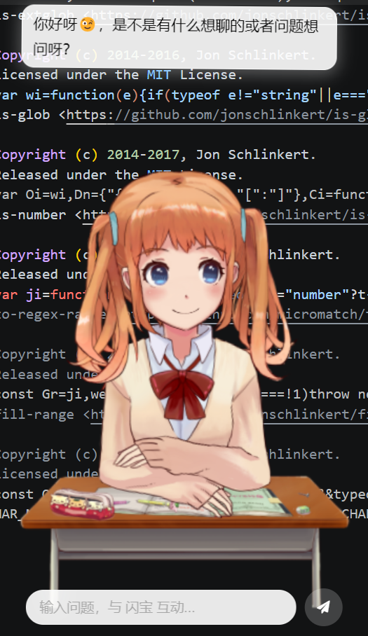
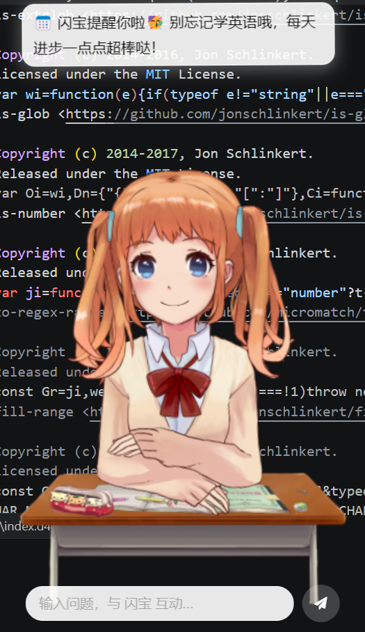
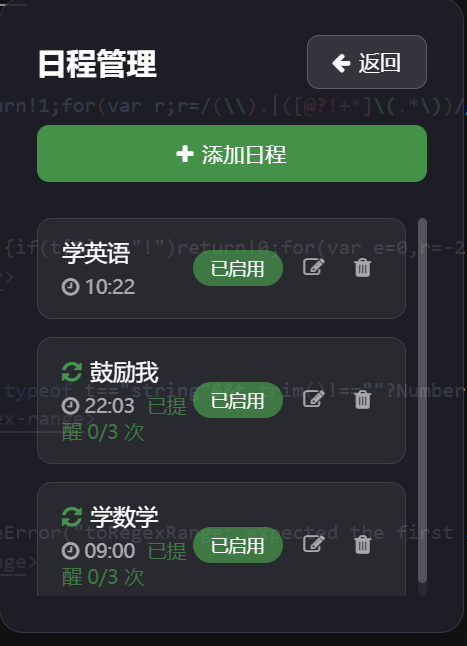
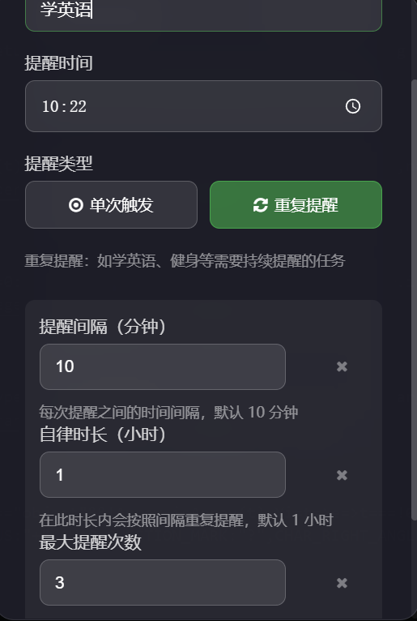
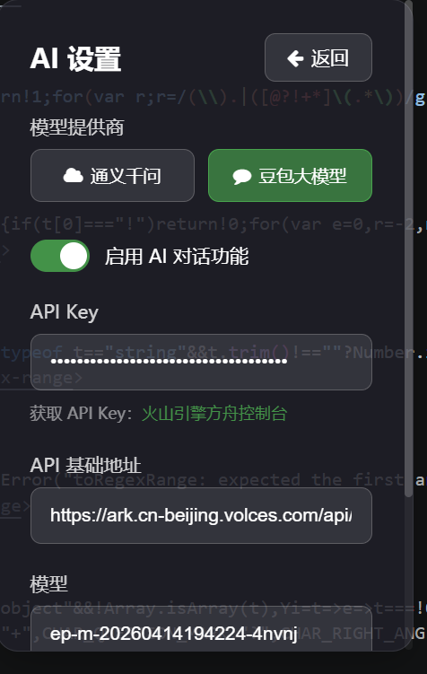

# AI_Pet

AI_Pet 是一款带有 AI 对话与日程提醒能力的桌面宠物应用。

## 项目展示

### 桌宠互动

### AI 日程提醒

### 日程管理

### 重复提醒配置

### AI 设置

## 安装

目前仅支持 Windows。

进入 `release` 文件夹，根据需要选择下面的文件：

- `PPet3_3.5.0.exe`：推荐使用，双击运行即可安装。
- `PPet3-v3.5.0-win-x64.zip`：Windows 64 位免安装压缩包，解压后运行里面的程序。
- `PPet3-v3.5.0-win-ia32.zip`：Windows 32 位免安装压缩包，解压后运行里面的程序。

其他文件说明：

- `latest.yml`、`PPet3_3.5.0.exe.blockmap`：自动更新相关文件。
- `win-unpacked`、`win-ia32-unpacked`：打包生成的解压目录。
- `builder-debug.yml`：打包调试文件。

## AI API 接入说明

打开软件后，点击右侧工具栏的魔法棒图标进入 `AI 设置`，按下面步骤配置：

1. 选择模型提供商：支持 `通义千问` 和 `豆包大模型`。
2. 打开 `启用 AI 对话功能`。
3. 填写对应平台的 `API Key`。
4. 确认 `API 基础地址` 和 `模型`。
5. 点击保存，返回主界面后即可在底部输入框与桌宠对话。

### 通义千问

- API Key 获取地址：[阿里云 DashScope 控制台](https://dashscope.console.aliyun.com/apiKey)
- API 基础地址：`https://dashscope.aliyuncs.com/compatible-mode/v1`
- 示例模型：`qwen3.5-plus`、`qwen-max`、`qwen-turbo`

### 豆包大模型

- API Key 获取地址：[火山引擎方舟控制台](https://console.volcengine.com/ark)
- API 基础地址：`https://ark.cn-beijing.volces.com/api/v3`
- 示例模型：`volcengine/doubao-seed-1-8-251228`

配置完成后，AI 功能会用于桌宠对话，也会在日程提醒触发时自动润色提醒内容。

## 说明

后续可以在这里继续补充项目介绍、功能说明和使用教程。
